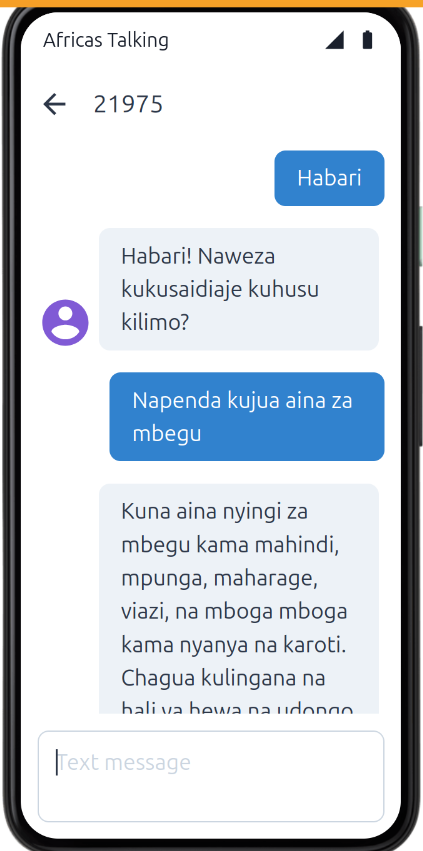

#  AgriSmart – USSD & SMS Agricultural Assistant (Kiswahili AI Bot)

**AgriSmart** is a hybrid **USSD-to-SMS** agricultural assistant that empowers farmers with timely, localized farming insights using **USSD menus** and **SMS conversations** — all in **Kiswahili** and **without internet**.

It combines:
- A **USSD interface** to guide farmers in selecting common farming issues.
- An **AI-powered SMS bot** to offer detailed responses using **OpenAI GPT-4o** or fallback answers.

---

##  Core Features

- USSD interface for intuitive menu navigation
- Two-Way SMS interaction powered by Africa’s Talking
- GPT-4o integration for smart Kiswahili replies
- Offline fallback via local JSON database (`fallback_sw.json`)
- Built with Node.js & Express.js
- Sandbox-compatible demo using [Africa’s Talking Simulator](https://account.africastalking.com/apps/sandbox/sms/simulator)

---

##  How It Works

###  USSD Flow (Offline Menu)

1. User dials USSD code (e.g. `*384*500#`)
2. Chooses issue (e.g., pest, weather, or crop advice)
3. Receives an SMS with a detailed response

###  SMS Bot (Smart AI Chat)

1. User sends an SMS describing an issue (e.g., `Nimeona wadudu kwenye mahindi`)
2. Bot uses GPT-4o (or fallback data) to generate a Kiswahili response
3. Response is sent back via SMS

---

##  Screenshots

### USSD Dial  


### USSD Menu  


### Confirmation Message  


### SMS Bot Flow  


---

##  Tech Stack

- **Node.js**
- **Express.js**
- **Africa's Talking API** (SMS & USSD)
- **OpenAI GPT-4o / GPT-4o-mini**
- **Ngrok** (for local development tunneling)

---

##  Live Demo (Simulator)

> Test in Sandbox using Africa’s Talking Simulator:

- **USSD**: Dial `*384*500#` (via simulator)
- **SMS**: Send `Nimeona wadudu kwenye mahindi`  
- **Shortcode**: `[your sandbox shortcode]`  
- **Sender**: Any dummy number (e.g. `+255712345678`)

 [Access the Simulator](https://account.africastalking.com/apps/sandbox/sms/simulator)

---

## Project Structure

```bash
agrismart/
├── app.js                  # Express app
├── index.js                # Server entry
├── africastalking.js       # Africa's Talking config
├── ussdRouter.js           # USSD flow logic
├── smsSender.js            # Sends SMS responses
├── fallback_sw.json        # Offline Kiswahili fallback data
├── .env                    # Env vars (keys, ports)
└── README.md
# AgriSmart
